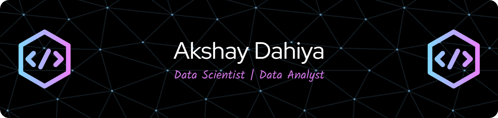

<h3 align="center">AI + Analytics + Automation. I build data-powered products that solve real problems at scale. Bridging code and insight, Machine Learning, Big Data, and Business Intelligence in action.</h3>

  

- 🔭 I’m currently working on **various projects**

- 📫 How to reach me **akshaydahiya61@gmail.com**

- ⚡ Fun fact **"I think I am funny😅"**

<h3 align="left">Connect with me:</h3>

<h3 align="left">Languages and Tools:</h3>

                         

&nbsp;

